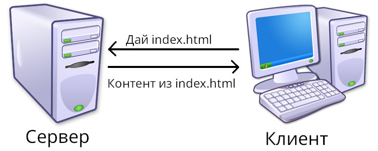
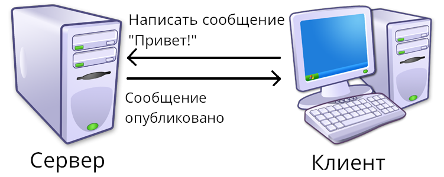
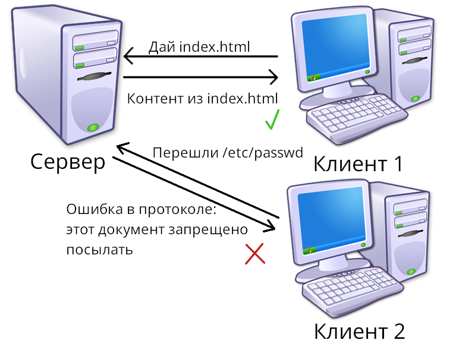

# 1.1. Структура интернета. Взаимодействие клиента и сервера. Введение в протоколы.

## 1.1.1 Структура интернета

*Интернет* - всемирная сеть, объединяющая компьютеры для передачи данных. На основе интернета работает World-wide Web (www, всемирная паутина), представляющая из себя гигантскую распределённую сеть, нужную для доступа к связанным между собой документам (часто их просто называют сайтами). Всемирная паутина сейчас является миллионами *веб-серверов*. В самом начале своего существования, к документы, размещённые в сети, можно было только смотреть (см. рис. 1).



Чуть позже, в 1999 году, был введён стандарт *WEB 2.0*, благодаря которому стало возможно взаимодействие подобное изображённому на рис. 2.

> [!NOTE]
> Подобное взаимодействие было возможно и до этого, однако WEB 2.0 принёс для этого гораздо более удобные средства 



На данный момент активно развивается стандарт WEB 3.0, который позволит отказаться от серверов, однако большой популярности ещё не приобрёл.

## 1.1.2 Введение в протоколы

*Протоколы* используются, чтобы стандартизировать взаимодействие с сервером. К примеру, простой протокол для передачи документов может выглядеть так:

```
Запрос к серверу:
ПОЛУЧИТЬ <имя документа>
Ответ от сервера:
ДОКУМЕНТ <имя документа>:
<содержание документа>
```

> [!NOTE]
> Протокол не является средствами/библиотеками для их исполнения. Протокол - формат структурирования данных, которому следует соответствовать, что бы вас понимали другие устройства использующие этот протокол. 



За время существования интернета появилось довольно большое количество протоколов, большая часть которых включена в модель OSI. В этой модели протоколы разделены на 7 основных слоёв: физический слой, слой данных, сетевой слой, транспортный слой, слой сессии, слой презентации, слой приложения. Таким образом, интернет  отнесён к физическому - слою данных, протокол IP отнесён сетевому слою, TCP, UDP - транспортный слой, HTTP - слой сессии - слой приложения.

## 1.1.3 Задания для практики

**1.1.3.1***: Придумайте простой протокол для обмена документами. Продумайте его для сервера и для клиента. Не забывайте, что с некоторым шансом, какие-то данные могут не дойти до сервера или дойти неправильно. Реализуйте ваш протокол используя следующий шаблон:

```python
def send_byte(bit: bool, addr: str):
    '''Посылает байт по адресу addr. Реализовывать эту функцию не обязательно'''
    ...

def receive_byte(addr: str):
    '''Получает байт от addr. Реализовывать эту функцию не обязательно'''
    return ...

class MyProtoServer:
    def on_user_requests(addr: str):
        ...

class MyProtoClient:
    def request(addr: str, content: str):
        ...
```

**Данная часть подошла к концу. В следующей, будут более подробное описание протоколов. Если нашли ошибку, пожалуйста напишите во вкладку `issues`.**

[README.md](./README.md)
