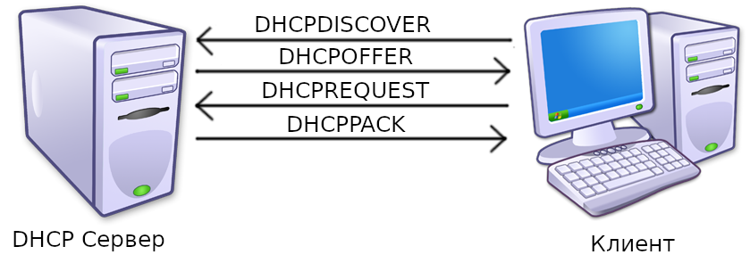
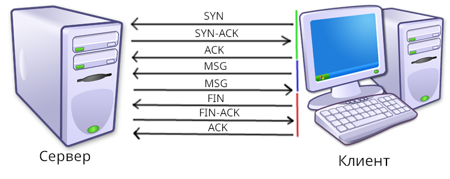

# 1.2. MAC и IP адреса. DHCP. Протоколы TCP, UDP.

## 1.2.1 MAC и IP адреса

Что бы компьютеры могли обмениваться информацией между собой, им необходимо понимать, кто есть кто. Таким образом появились MAC и IP адреса. MAC адреса никогда не меняются и обычно зашиты в компьютер на аппаратном уровне. А вот IP адреса меняются очень часто (например, если вы подключитесь к новой сети wifi, ваш ip адрес поменяется). 

Чаще мы будем использовать IP адрес. Существует два IP протокола: IPv4 и IPv6. Нужны они по сути для одного и того же, но IPv4 устарел, из за чего мир медленно переходит на v6. Адреса IPv4 выглядят как 4 числа до 256, разделённых точкой. Например: `192.168.0.1`. Всего может существовать 4,294,967,296 адресов, что оказалось недостаточным. После того как адреса подошли к концу был создан IPv6. Пример такого адреса - `2001:0db8:11a3:09d7:1f34:8a2e:07a0:765d`.  

> [!NOTE]
> Интересный факт: существовал также IPv5, но его довольно быстро вытеснил IPv6

## 1.2.2 DHCP 

Что бы получить новый ip адрес, компьютеру необходимо воспользоваться *протоколом DHCP* (Dynamic Host Configuration Protocol). Сессия DHCP состоит из запросов четырёх видов: `discover`, `offer`, `request`, `pack`. Первый используется клиентом для обнаружение DHCP серверов поблизости. После получение запроса от клиента, сервер может согласится и прислать `offer`. Выбрав подходящий сервер, клиент посылает `request`, на что сервер отвечает посылает подтверждение `pack` (также может называться `acknowledgement`). 

## 1.2.3 TCP, UDP

TCP и UDP - протоколы транспортного уровня. Эти протоколы довольно похожи, оба основаны протоколе IP. IP позволяет пересылать данные. Все данные в этом протоколе делятся на *пакеты*. Все данный посылаются пакетами, при этом они могут быть разного размера. В отличии от TCP, IP не даёт гарантии, на то, что все пакеты дойдут и при этом в правильном порядке, из-за чего TC сильно упрощают программирование.

Но эти протоколы имеют сильные различия: в UDP, как и IP, некоторые пакеты всё же могут не дойти. Так как TCP использует больше траффика для проверки целостности пакетов, UDP используют для задач требующих транспортировки больших объёмов данных, например пересылка больших файлов, отправка данных в компьютерных играх, и. т. п. Здесь мы будем рассматривать только TCP, т. к. http, который нам понадобится позже, основан на нём.

Сессию TCP можно поделить на 3 основные части: создание подключения, обмен данными, закрытие подключения.

1. **Создание подключения.** Клиент посылает сообщение с флагом SYN, намереваясь создать подключение. Сервер отвечает согласием SYN-ACK, на что клиент подтверждает сообщением ACK.

2. **Обмен информацией.** На этом этапе клиент и сервер свободно обмениваются сообщениями, при этом тратя часть траффика на проверку

3. **Закрытие подключения.** Клиент посылает FIN, сервер присылает подтверждение FIN-ACK. Клиент подтверждает с помощью ACK.

## 1.2.4 Задания для практики

**1.2.4.1:** Напишите простой клиент для TCP. Он должен уметь отправлять сообщения к серверу и получать ответ (если он будет). Почитать о работе с TCP в Python можно [здесь](https://habr.com/ru/articles/149077/).

**1.2.4.2***: Напишите GUI для вашего клиента
