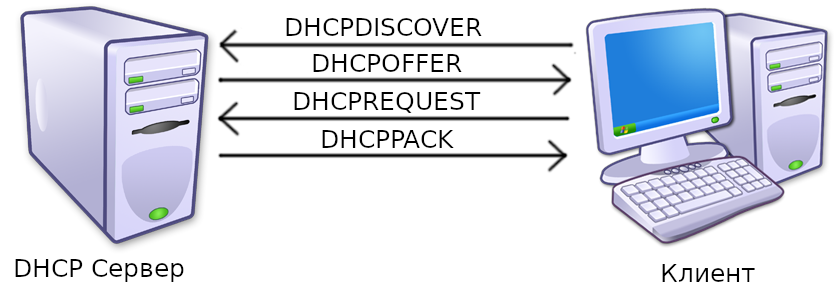

# 2. MAC и IP адреса. DHCP. Локальные и глобальные сети. Протоколы TCP, UDP

## 2.1 MAC и IP адреса

Что бы компьютеры могли обмениваться информацией между собой, им необходимо понимать, кто есть кто. Таким образом появились MAC и IP адреса. MAC адреса никогда не меняются и обычно зашиты в компьютер на аппаратном уровне. А вот IP адреса меняются очень часто (например, если вы подключитесь к новой сети wifi, ваш ip адрес поменяется). 

Чаще мы будем использовать IP адрес.

## 2.2 DHCP 

Что бы получить новый ip адрес, компьютеру необходимо воспользоваться *протоколом DHCP* (Dynamic Host Configuration Protocol). Сессия DHCP состоит из запросов четырёх видов: `discover`, `offer`, `request`, `pack`. Первый используется клиентом для обнаружение DHCP серверов поблизости. После получение запроса от клиента, сервер может согласится и прислать `offer`. Выбрав подходящий сервер, клиент посылает `request`, на что сервер отвечает посылает подтверждение `pack` (также может называться `acknowledgement`). 

## 2.3 Локальные и глобальные сети

Прежде чем создавать сервера, следует уяснить, что просто так к вашей машине ни кто не сможет подключится.
