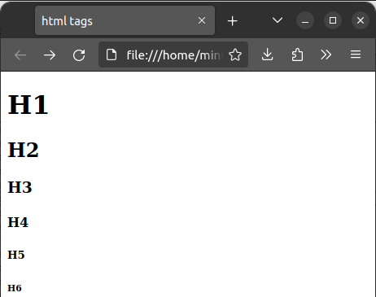
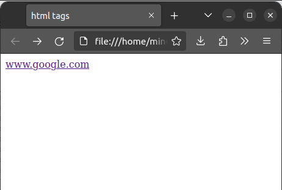
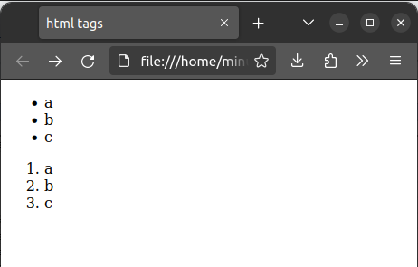

# 2.1. HTML. Структура HTML документа. Основные теги. 

## 2.1.1. HTML

HTML - язык разметки *гипертекста* (англ. Hypertext Markup Language), используется для разметки документов (которые могут быть переданы, например, с помощью HTTP). Гипертекст - текст созданный с помощью языка разметки. На данный момент, последняя версия HTML - 5.3, который поддерживается на всех существующих браузерах. Однако, далеко не все фичи HTML поддерживаются везде, что создаёт некоторую путаницу в мире фронт-енд разработки.

## 2.1.2. Структура HTML документа

HTML документ состоит из *тегов* (произносится как "тэг") - единичный элемент любой разметки. Теги делятся на два типа - открывающий и закрывающий. У всех тегов пишется `<` в начале и `>` в конце. При этом у закрывающих тегов также пишется `/` после открывающей скобки. Пример тега - `<tag> какой-то текст или другие теги </tag>`. Следует заметить, что все теги должны быть **строго вложены**:

```html
<div><span></div></span> <!-- Не правильно -->
<div><span></span></div> <!-- Правильно -->
```

Также, допускается использование одиночных тегов:

```html
<br /> <!-- или -->
<br>
```

У тегов есть *аттрибуты* - условно, аргументы позволяющие настраивать тег. Например:

```html
<svg width="400" height="180">
  <rect x="50" y="20" rx="20" ry="20" width="150" height="150" style="fill:red; stroke:black; stroke-width:5; opacity:0.5" />
</svg>
```

Теперь, перейдём к структуре html документа:

```html
<!DOCTYPE html> <!-- этот тег нужен, что бы браузер корректно воспринимал документ -->
<html> <!-- В этот тег вложены все остальные теги -->
    <head> <!-- Внутри head записываются настройки, подгружаются скрипты и стили, и. т. п. -->
        <title>Html page</title> <!-- Тег title указывает заголовок страницы -->
    </head>
    <body> <!-- Сюда вписываются теги, непосредственно отображающиеся на странице -->
        <h1>This is heading</h1>
        <p>This is paragraph</p>
    </body>
</html>
```
## 2.1.3. Основные теги

### 2.1.3.1. Теги `<p>` и `<br>`


Тег `<p>` используется для создания параграфа (блока текста ограниченного символом переноса строки с обоих сторон).
Альтернативой тегу `<p>` может стать тег `<br>`, который представляет из себя символ переноса строки.

**Пример использования:** `<p>Paragraph</p><br>This text starts from new line`

### 2.1.3.2. Теги `<b>` и `<i>`

Теги `<b>` и `<i>` используется для жирного и курсивного шрифта соответственно.

**Пример использования:** `<b>bold text</b> <i>italic text</i>`

### 2.1.3.3. Теги `<sub>` и `<sup>`

Теги `<sub>` и `<sup>` используется для написания маленького текста снизу и сверху (см. рис. 1).

**Пример использования:** `A<sub>1</sub> = 2<sup>2</sup>`

### 2.1.3.4 Теги заголовков



В HTML есть целых 6 тегов для заголовков (см. рис. 2) и выглядят они так:

```html
<h1>H1</h1>
<h2>H2</h2>
<h3>H3</h3>
<h4>H4</h4>
<h5>H5</h5>
<h6>H6</h6>
```

### 2.1.3.4 Гиперссылки



Для гиперссылок используется тег `<a>`. С помощью следующего кода, можно вставить ссылку на `google.com`:

```html
<a href="https://www.google.com/">Эта ссылка ведёт на google.com</a>
```

Важно заметить, что тег `<a>` позволяет вставлять ссылки не только на сайты, но и на телефоны и на почту. Для этого используйте `mailto:<адрес почты>` и `tel:<номер телефона>`.

Также, этот тег обладает довольно большим списком аттрибутов:

| аттрибут | использование |
| -------- | ------------- |
| `download` | Пометить ссылку как файл, доступный для загрузки |
| `filename` | Использовать это имя при загрузке файла |
| `ping` | Список URL. На каждое из них браузер пошлёт POST запрос |
| `target` | При значении `_self` откроет ссылку в текущей вкладке, `_blank` - в новой |

### 2.1.3.5 Списки 



Что бы создавать списки, используйте теги `<ul>` и `<ol>` для ненумерованного и нумерованного списка соответственно. `<ol>` обладает списком полезным аттрибутов:

| аттрибут | использование |
| --- | --- |
| `reversed` | При использовании нумерация перевёрнута |
| `type` | Тип нумерации: a - строчные буквы, A - заглавные буквы, i - строчные римские цифры, I - заглавные римские цифры | 

## 2.1.3.6 Изображения


Изображение реализуется по средствам тега ``,  который поддерживает форматы `apng`, `avif`, `gif`, `jpeg`, `png`, `svg`, `webp`.
Пример:

```html
 <!-- или -->

```

| аттрибут | использование |
| --- | --- |
| `alt` | Подпись картинки |
| `height` | Высота картинки в пикселях |
| `loading` | При значении `eager` картинка загружается мгновенно, `lazy` - как только картинка становится видна пользователю |
| `width` | Ширина картинки в пикселях |

## 2.1.3.7 Смысловые теги

В html есть группа тегов, которые ни чего не делают, но используются разработчиками для облегчения чтения кода документа. Вот их полный список: 

| Тег | значение |
|---|---|
| `<article>` | Статья |
| `<aside>` | Боковая панель |
| `<code>` | Код |
| `<div>` | Секция разметки (используется для отделения блоков) |
| `<footer>` | Футер |
| `<header>` | Хедер |
| `<main>` | Главный контент страницы |
| `<nav>` | Навигационная панель |
| `<section>` | Секция |
| `<span>` | Секция разметки (используется для отделения элементов внутри одной строки) |

## 2.1.4. Задания для практики

**2.1.4.1**: Сделайте макет для форума. Нужны три страницы: главная, страница ветки, страница пользователя. На главной должно быть приветствие и список открытых веток и пагинация. На странице ветки есть название ветки, описание и список сообщения. Сообщения - автор и текст сообщения. Страница пользователя - имя пользователя, список веток в которых он участвовал. Стили в этом задании писать не нужно

