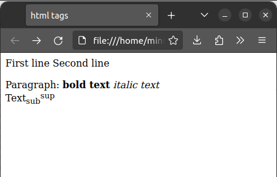

# 2.1 HTML. Структура HTML документа. Основные теги. 

## 2.1.1 HTML

HTML - язык разметки *гипертекста* (англ. Hypertext Markup Language), используется для разметки документов (которые могут быть переданы, например, с помощью HTTP). Гипертекст - текст созданный с помощью языка разметки. На данный момент, последняя версия HTML - 5.3, который поддерживается на всех существующих браузерах. Однако, далеко не все фичи HTML поддерживаются везде, что создаёт некоторую путаницу в мире фронт-енд разработки.

## 2.1.2 Структура HTML документа

HTML документ состоит из *тегов* (произносится как "тэг") - единичный элемент любой разметки. Теги делятся на два типа - открывающий и закрывающий. У всех тегов пишется `<` в начале и `>` в конце. При этом у закрывающих тегов также пишется `/` после открывающей скобки. Пример тега - `<tag> какой-то текст или другие теги </tag>`. Следует заметить, что все теги должны быть **строго вложены**:

```html
<div><span></div></span> <!-- Не правильно -->
<div><span></span></div> <!-- Правильно -->
```

Также, допускается использование одиночных тегов:

```html
<br /> <!-- или -->
<br>
```

У тегов есть *аттрибуты* - условно, аргументы позволяющие настраивать тег. Например:

```html
<svg width="400" height="180">
  <rect x="50" y="20" rx="20" ry="20" width="150" height="150" style="fill:red; stroke:black; stroke-width:5; opacity:0.5" />
</svg>
```

Теперь, перейдём к структуре html документа:

```html
<!DOCTYPE html> <!-- этот тег нужен, что бы браузер корректно воспринимал документ -->
<html> <!-- В этот тег вложены все остальные теги -->
    <head> <!-- Внутри head записываются настройки, подгружаются скрипты и стили, и. т. п. -->
        <title>Html page</title>
    </head>
    <body> <!-- Сюда вписываются теги, непосредственно отображающиеся на странице -->
        <h1>This is heading</h1>
        <p>This is paragraph</p>
    </body>
</html>
```
## 2.1.3 Основные теги

| тег | зачем используется | Пример |
| --- | ------------------ | ------ |
| `<title>` | Заголовок страницы. | `<title>Входящее (2) - почта</title>` |
| `<h1> ... <h6>` | Крупный текст (при этом, чем больше число в теге, тем меньше текст). см. рис. 1 | `<h1>Heading</h1>` |
| `<p>` | Тег параграфа. Параграф всегда начинается с новой строки | `<p>A lot of text</p>` |
| `<b> и <i>` | Теги жирного и курсивного текста | `<b>This text is bold. <i>This text is also italic</i></b>` |
| `` | Изображение | `` |
| `<a>` | Ссылка | `<a href="www.google.com">` |
| `<ul>` | Список | ```<ul><li>a</li><li>b</li></ul>``` |
| `<div>` | Этот тег не изменяет вид содержимого, но часто используется для пользовательских стилей | `<div class=style>text</div>` |

Больше о тегах можно почитать [здесь](https://developer.mozilla.org/en-US/docs/Learn/Getting_started_with_the_web/HTML_basics).

 

## 2.1.4 Задания для практики

**2.1.4.1**: Сделайте макет для форума. Нужны три страницы: главная, страница ветки, страница пользователя. На главной должно быть приветствие и список открытых веток и пагинация. На странице ветки есть название ветки, описание и список сообщения. Сообщения - автор и текст сообщения. Страница пользователя - имя пользователя, список веток в которых он участвовал. Стили в этом задании писать не нужно
