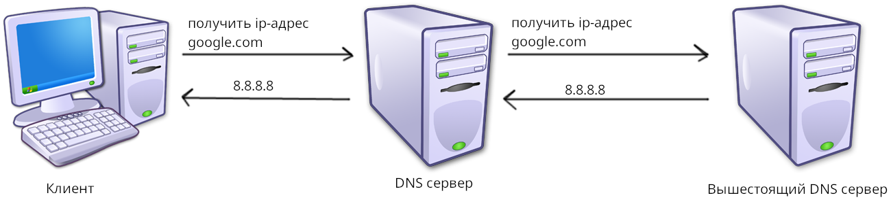

# 1.3. Протокол DNS. URL адреса и их структура. Протокол HTTP. HTTP методы. Написание HTTP сервера с использованием Flask. 

## 1.3.1. Протокол DNS

Часто, обращаться к сервисам по ip адресу и порту бывает довольно не удобно. Чтобы облегчить запрос к сервису был создан *протокол DNS* (Domain Name System). Этот протокол представляет из себя условный "телефонный справочник", но для сайтов и веб-сервисов. В этом справочнике каждая запись представляет из себя адрес сервиса и сокращение именуемое *доменом* (англ. domain). Домены гораздо легче запоминаются, например - google.com.

Следует заметить, что во многих доменах можно найти части, которые лего встретить и в других доменах. Они идут на конце и называются *зонами* - `.com`, `.ru`, `.io`, и. т. п.. Также можно обнаружить *поддомены* (англ. subdomain) - домены более низкого уровня, как правило, располагающиеся на той же машине, на которой располагается домен. В `mysite2.mysite1.mysite.com` - `mysite2` и `mysite1` - поддомены.

DNS - распределённая система, т. е. не существует какого-то "главного" сервера. На DNS серверах, естественно не содержат всех доменных имён мира. В случае если DNS сервер не может найти запись о каком-то домене, он просит это сделать вышестоящий сервер (см. рис. 6). Если и вышестоящий сервер не сможет найти запись то предаст ещё более вышестоящему серверу, и. т. д..



## 1.3.2. URL адреса и их структура

В http, а также в обширной группе других протоколов используются URL-адреса. URL адреса - это URI адреса используемые для идентификации веб ресурсов использующий более строгий синтаксис (однако, все URL также URI). а URI - уникальная последовательность символов используемая для нахождения физических или логических ресурсов. Синтаксис URI выглядит следующим образом:

```
<протокол>://<домен>[/страница1][/страница2][...][?[параметр=значение][&параметр1=значение2][...]][#якорь]
```

Давайте разберём, что же здесь происходит. В самом начале идёт протокол - чаще всего можно встретить http или https, а за ним - домен, который мы уже обсуждали ранее. Таким образом, минимальный адрес может выглядеть, на пример так: `https://google.com/`. Дальше идут страницы (или документы). На одном сайте могут находится сразу несколько документов и находится они будут каждый на своей странице, например:

```
http://mysite.com/ - index.html
http://mysite.com/login - login.html
http://mysite.com/user/1 - user.html
``` 

Затем, через ?, пишутся *аргументы*, а через # - якорь (якорь указывает, местоположение на странице). Пример адреса, использующего это всё - `http://mysite.com/user/14?view=list&action=view#paragraph1`. **Важно заметить,** что аргументы передаются странице, а не определяют новую:

```
http://mysite.com/user - user.html
http://mysite.com/user?view=list - user.html, view=list
```

> [!NOTE]
> Существует также URN - URI использующийся для идентификации ресурсов в определённом неймспейсе, например: urn:isbn:0-486-27557-4

## 1.3.3. Протокол HTTP

HTTP - клиент-серверный протокол, использующийся для обмена документами, обычно HTML или JSON. В HTTP клиент может отправить запрос (англ. request), на что сервер может отправить ответ (англ. response). Рассмотрим HTTP запрос:

```HTTP
GET / HTTP/1.1
Host: www.google.com
Accept-language: en
```

В 1 строке пишется тип запроса (в данном случае `GET`, англ. method). После него URL адрес (протокол и домен не пишется: `https://www.google.com/` -> `/`). И замыкает версия протокола. Здесь - `HTTP/1.1`. После него идут *заголовки* - переменные передающиеся по типу `ключ: значение`. Все ключи определены заранее и их можно посмотреть на сайте [mdn web docs](https://developer.mozilla.org/ru/docs/Web/HTTP/Headers).

Теперь рассмотрим ответ:

```HTTP
HTTP/1.1 200 OK
server: gws
content-type: text/html; charset=UTF-8
date: Wed, 20 Dec 2023 04:43:15 GMT
<!DOCTYPE html>
<html itemscope="" itemtype="http://schema.org/WebPage" lang="en-RU">
    <head>
        <meta charset="UTF-8">
...
```

В первой строке расположены версия, код ответа, статус ответа (см. ниже). Затем идут заголовки (как и в запросе), а после них - документ. Здесь приведены самые популярные коды ответа и их значения:

| Код ответа | Значение |
| ---------- | -------- |
| 200 OK | Операция прошла успешно |
| 201 Created | Объект создан |
| 302 Found | Объект найден |
| 307 Temporary Redirect | Перенаправление на другую страницу |
| 400 Bad Request | Некорректный запрос |
| 401 Unauthorized | Клиент не авторизован |
| 404 Not Found | Страница не найдена |
| 405 Method Not Allowed | Метод недоступен |
| 408 Request Timeout | Превышено время исполнения запроса |
| 500 Internal Server Error | Внутренняя ошибка сервера |

Все коды HTTP ответов делятся на 5 категорий (по 1 цифре): Информационные ответы (1xx), успешные ответы (2xx), перенаправление (3xx), ошибка клиента (4xx), ошибка сервера (5xx).


